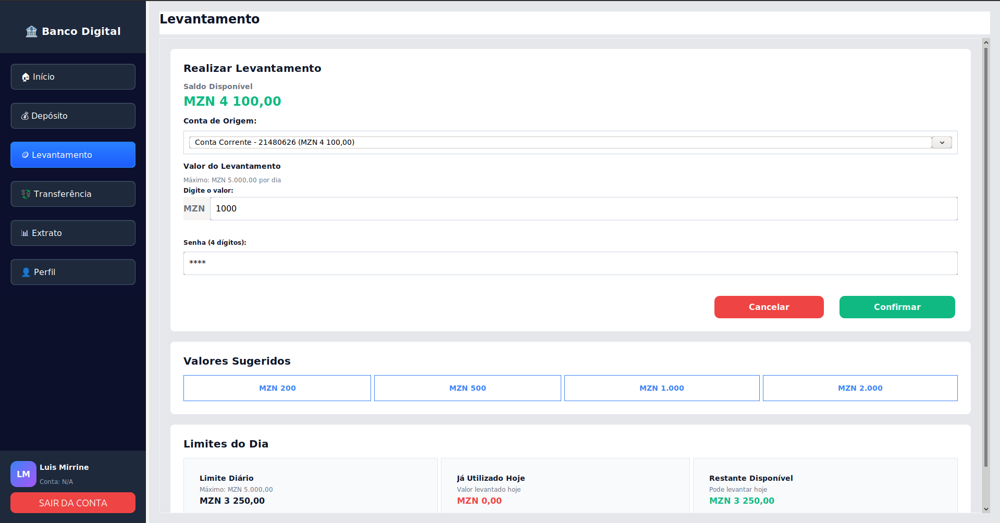
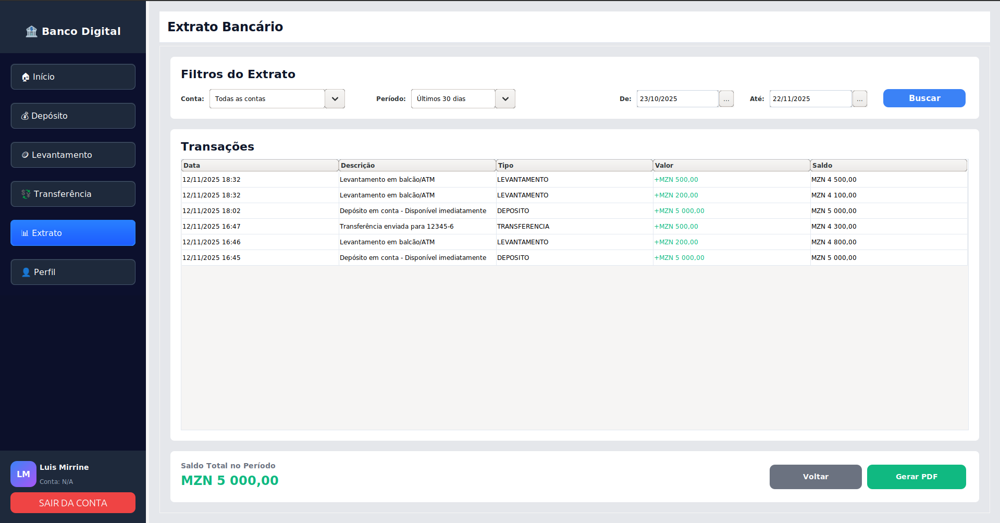
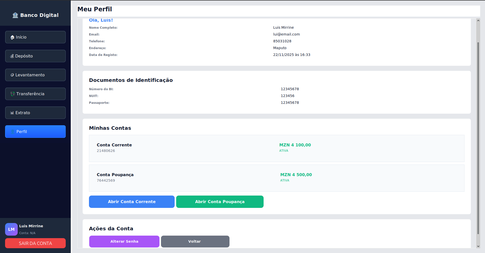

# 🏦 Sistema Bancário Digital

[](https://java.com)
[](https://mysql.com)
[](https://maven.apache.org)
[](https://docs.oracle.com/javase/tutorial/uiswing/)

Aplicação bancária desktop em Java com interface Swing.

## ✨ Funcionalidades

- 👤 Autenticação segura com múltiplos níveis de acesso (ADMIN, MANAGER, STAFF)
- 💳 Gestão de contas (Corrente/Poupança)
- 💰 Operações Bancárias: Depósitos, levantamentos, transferências
- 📊 Dashboard Interativo
- 📋 Extrato bancário completo
- 🔧 Painel administrativo
- 🔐 Segurança: **Hash SHA-256** para senhas e PINs

## 🛠️ Tecnologias Utilizadas

### Backend
| Tecnologia | Versão | Uso |
|-----------|--------|-----|
| **Java** | 21+    | Linguagem principal |
| **MySQL** | 8.0+   | Banco de dados relacional |
| **Maven** | 3.8+   | Gestão de dependências e build |

### Frontend (Swing)
| Componente | Versão | Funcionalidade |
|-----------|--------|---|
| **Java Swing** | Native | Interface gráfica desktop |
| **MigLayout** | 5.3 | Layouts responsivos e profissionais |
| **Timing Framework** | 1.0 | Animações suaves e transições |

### Bibliotecas Adicionais
| Biblioteca | Versão | Propósito |
|-----------|--------|----------|
| **MySQL Connector** | 8.0.33 | Conexão com banco de dados |
| **iText 5** | 5.5.13.3 | Geração de PDFs com formatação |
| **JUnit 5** | 5.9.2 | Testes unitários |

## 📸 Screenshots

### Dashboard Principal


### Operações - Levantamento


### Extrato Bancário com Exportação PDF


### Perfil


## 🚀 Instalação Rápida

### Pré-requisitos
```bash
java -version          # Java 21+
mysql --version        # MySQL 8.0+
mvn --version          # Maven 3.8+
```

### Setup

**1. Clone o repositório**
```bash
git clone https://github.com/lamirrine/Bank_System.git
cd Bank_System
```

**2. Configure o banco de dados**
```bash
mysql -u root -p
```

```sql
CREATE DATABASE bancodigital_db CHARACTER SET utf8mb4 COLLATE utf8mb4_0900_ai_ci;
USE bancodigital_db;
SOURCE src/main/resources/db/ddl_script.sql;
```

**3. Atualize credenciais (se necessário)**

Edite `src/main/java/config/DatabaseConnection.java`:
```java
private static final String URL = "jdbc:mysql://localhost:3306/bancodigital_db";
private static final String USER = "root";
private static final String PASSWORD = "root";
```

**4. Compile e execute**
```bash
mvn clean compile
mvn exec:java -Dexec.mainClass="main.App"
```

## 🔐 Credenciais de Teste

### Clientes
| Email | Senha | PIN | Tipo |
|-------|-------|-----|------|
| joao@email.com | 1234 | 1234 | Cliente Ativo |
| lui@email.com | 1234 | 1234 | Cliente Ativo |

### Funcionários
| Email | Senha | Nível |
|-------|-------|-------|
| admin@banco.com | 1234 | ADMIN (Full Access) |
| lewis@email.com | 1234 | MANAGER |

## 📂 Estrutura

```
src/main/java/
├── App.java                   ← Ponto de entrada
├── config/DatabaseConnection.java
├── controller/                ← Controllers
├── model/
│   ├── entities/              ← Modelos
│   ├── dao/                   ← Banco de dados
│   ├── services/              ← Lógica
│   └── utils/                 ← Utilidades
└── view/                       ← Interface gráfica
```

